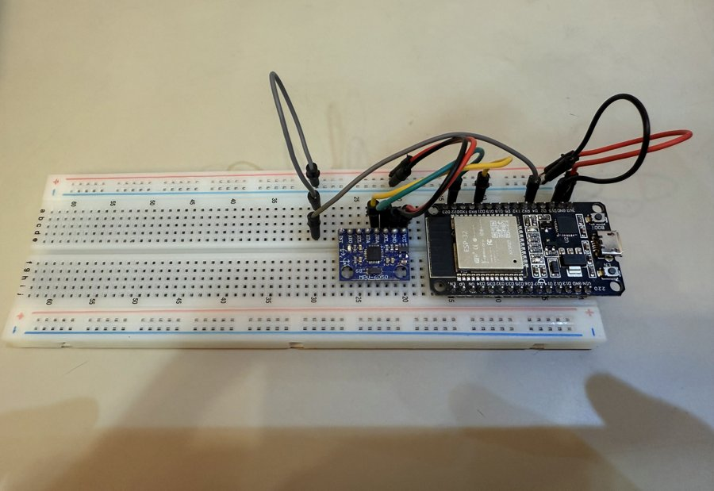
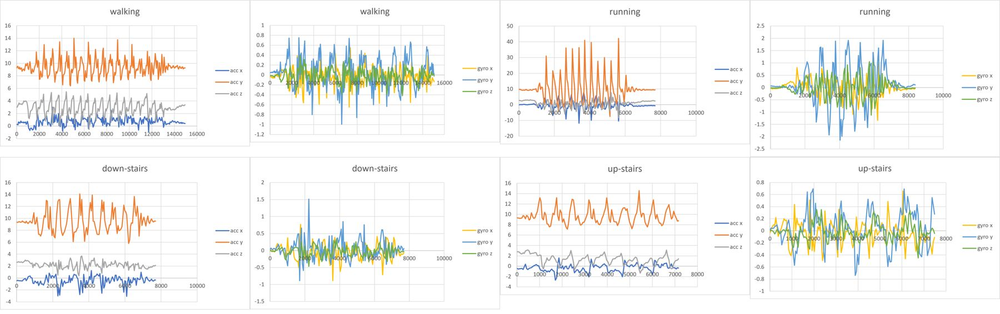

# Human Activity Mode Detection with an ESP32 and an MPU6050

A small embedded measurement pipeline that tells **walking, running, up-stairs and down-stairs** apart
using only the accelerometer and gyroscope of an MPU6050 IMU. The ESP32 reads the sensor at ~20 Hz,
computes features over a 2-second sliding window and classifies the activity in real time with a
transparent, rule-based decision tree. Python scripts handle labeled data logging, offline feature
extraction and accuracy evaluation.

> Course project for *Measurement and Control Systems* (Spring 2026). Full write-up: [`docs/report.pdf`](docs/report.pdf).



## Results

Real-time accuracy on the ESP32, one prediction per 2-second window, single subject, 5 trials per activity:

| Activity    | Windows | Correct | Accuracy |
|-------------|--------:|--------:|---------:|
| Walking     |     545 |     495 |   90.83% |
| Running     |     339 |     319 |   94.10% |
| Up-stairs   |     502 |     344 |   68.53% |
| Down-stairs |     563 |     139 |   24.69% |
| **Overall** | **1949**| **1297**| **66.55%** |

Running and walking have distinctive signatures and are detected reliably. Stair climbing, and
especially stair descent, overlap with walking in the chosen features, so fixed thresholds fail on
many windows (see [Limitations](#limitations)).

Per-activity mean of the three features used by the classifier (20 trials, see `data/processed/`):

| Activity    | accY std | accZ std | gyroY ptp |
|-------------|---------:|---------:|----------:|
| Walking     |    1.546 |    1.138 |     1.771 |
| Running     |    8.154 |    2.226 |     4.435 |
| Up-stairs   |    1.550 |    0.974 |     2.009 |
| Down-stairs |    1.845 |    0.574 |     1.629 |



## Hardware

| Component        | Model                                              |
|------------------|----------------------------------------------------|
| Microcontroller  | ESP32 DevKit (CP2102 USB-UART, USB Type-C)         |
| IMU              | MPU6050 on a GY-521 breakout                       |
| Breadboard/wires | MB-102 breadboard, jumper wires                    |
| Start/stop input | Touch-wire on D4 (internal pull-up) instead of a push button |

| ESP32 pin | MPU6050 pin | Function                         |
|-----------|-------------|----------------------------------|
| 3V3       | VCC         | 3.3 V supply                     |
| GND       | GND         | Common ground                    |
| D21       | SDA         | I²C data                         |
| D22       | SCL         | I²C clock                        |
| D4        | – (touch wire to GND) | Recording start/stop   |

The sensor is detected at I²C address `0x68`. The Proteus design is in
[`hardware/proteus/`](hardware/proteus/) and a printed schematic in [`hardware/schematic.pdf`](hardware/schematic.pdf).

## Repository layout

```
.
├── firmware/
│   ├── activity_detector/        # FINAL sketch: logger + real-time classifier
│   ├── data_logger/              # stage 2: labeled logger only (recorded the training trials)
│   ├── realtime_classifier/      # stage 3: classifier only
│   └── mpu6050_test/             # stage 1: sensor wiring test
├── scripts/
│   ├── serial_logger.py          # label sender, CSV logger, accuracy evaluation
│   └── extract_features.py       # per-trial mean / std / peak-to-peak features
├── data/
│   ├── raw/                      # trials_raw.csv (20 trials), accuracy_run.csv (real-time run)
│   ├── processed/                # features_summary.csv
│   └── results/                  # accuracy_summary.csv
├── hardware/                     # Proteus project + schematic PDF
└── docs/                         # report.pdf and images
```

See [`data/README.md`](data/README.md) for the data dictionary and how the datasets were prepared.

## Getting started

### 1. Flash the firmware

1. Install the ESP32 board package in the Arduino IDE and select **ESP32 Dev Module**.
2. Install **Adafruit MPU6050** and **Adafruit Unified Sensor** from the Library Manager.
3. Open `firmware/activity_detector/activity_detector.ino` and upload it.

The other sketches in `firmware/` are the development stages that led to it (sensor test, logger only, classifier only).
The 20 training trials were recorded with `data_logger` (8 columns, no `detected`); the accuracy run used the final sketch.

### 2. Record data and evaluate accuracy

```bash
python -m venv .venv && source .venv/bin/activate      # Windows: .venv\Scripts\activate
pip install -r requirements.txt

python scripts/serial_logger.py --port COM6            # Linux/macOS: /dev/ttyUSB0
```

Close the Arduino Serial Monitor first. Type a label (`Walking`, `Running`, `Up-stairs`, `Down-stairs`),
touch the D4 wire to GND to start recording, perform the activity for 20–30 s, touch again to stop.
Press `Ctrl+C` to save `recorded_data.csv` and `accuracy_summary.csv` to `data/raw/`.

### 3. Extract features offline

```bash
python scripts/extract_features.py        # data/raw/trials_raw.csv -> data/processed/features_summary.csv
```

## How it works

**Serial output format** (9 columns, ~20 Hz): `time_ms,label,accX,accY,accZ,gyroX,gyroY,gyroZ,detected`

**Sliding window:** the last 40 samples (~2 s) of `accY`, `accZ` and `gyroY`. For every new sample, once the
window is full, the firmware computes `accY std`, `accZ std` and `gyroY peak-to-peak` and applies:

```
if   accY_std > 4.0                          -> Running
elif accZ_std < 0.7 and gyroY_ptp < 1.8      -> Down-stairs
elif accZ_std < 1.1                          -> Up-stairs
else                                         -> Walking
```

The thresholds were chosen from the trial-averaged features in `data/processed/features_summary.csv`.
Sensor ranges: ±8 g, ±500 °/s, 21 Hz digital low-pass filter.

## Limitations

- **Single subject, single mounting position and orientation** (strapped to the waist/chest), so the
  thresholds are unlikely to generalize to other people or placements.
- **Fixed thresholds** tuned on trial averages. Individual windows often cross the boundaries, which is why
  up-stairs and especially down-stairs are misclassified.
- **Only three scalar features** over a 2 s window at 20 Hz; transitions between activities are
  misclassified because the window still holds samples of the previous activity.
- Low-cost MEMS noise and no calibration beyond the factory offsets.

## Ideas for future work

- Add frequency-domain features (FFT dominant frequency, step rate).
- Collect data from several subjects and sensor placements.
- Replace the hand-tuned rules with a small trained classifier (e.g. a decision tree) on the same features.
- Stream data over Wi-Fi instead of USB serial.

## License

MIT, see [`LICENSE`](LICENSE).
